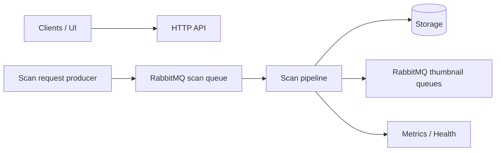

# Architecture

## Purpose

This service keeps a gallery index in sync with media files on disk.

At a high level, it does two things:

- exposes a small HTTP API to browse directories and images
- processes asynchronous scan requests and updates persistent storage

The design goal is to keep scanning logic decoupled from storage and downstream processing so adapters can evolve over time.

## System context

## Core components

- `HTTP API` (`DirectoriesController`, `ImagesController`): read and manage indexed directories/images.
- `Scan intake` (`ScanRequestsListener`): receives scan requests from RabbitMQ.
- `Scan orchestration` (`ScanService`, `LocalMediaScanner`): validates requests, walks filesystem, classifies changes.
- `Event hub` (`ScanEventsHub` + listeners): applies side effects (storage updates, metrics, thumbnail requests).
- `Persistence` (repositories + adapters): stores directory/image hierarchy and query results.
- `Thumbnail adapter` (`ThumbnailsService`): publishes generate/refresh/delete requests.

## High-level flow

1. A directory is registered in the system.
2. A scan request is published to RabbitMQ.
3. The scanner validates and traverses the target path.
4. Files are classified as new, updated, unchanged, or missing.
5. Storage is reconciled to reflect the latest scan state.
6. Thumbnail work is requested asynchronously.
7. Clients query indexed data via HTTP.

## Operation triggers

| Operation | Trigger | Entry point |
|---|---|---|
| Register/browse directories | HTTP requests | `DirectoriesController` |
| Browse images | HTTP requests | `ImagesController` |
| Start scan | RabbitMQ message | `ScanRequestsListener` |
| Persist scan effects | Scanner events | scan event listeners |
| Request thumbnail work | Scanner events | `ThumbnailsService` |
| Emit telemetry | Scanner events | metrics listener |

## Design principles

- `Event-driven scanning`: discovery and side effects are separated through scan events.
- `Adapter-based boundaries`: storage and thumbnail work are behind service/repository abstractions.
- `Async by default`: scan intake and thumbnail processing are message-based.
- `Operational visibility`: logs, metrics, and health endpoints are part of the runtime contract.
- `Maintainable scope`: this document stays conceptual; implementation details live in code and development docs.

## Notes

- This document intentionally stays backend-agnostic and refers to `storage`.
- For implementation details and local setup, see `docs/DEVELOPMENT.md`.
